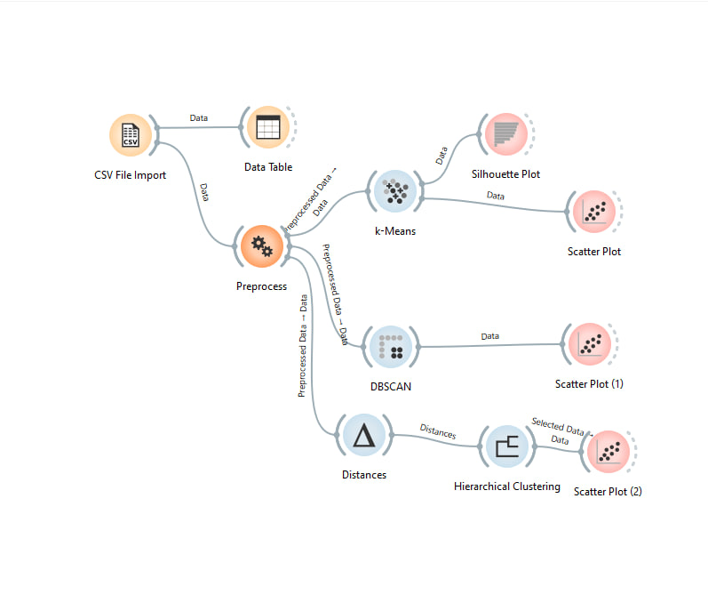
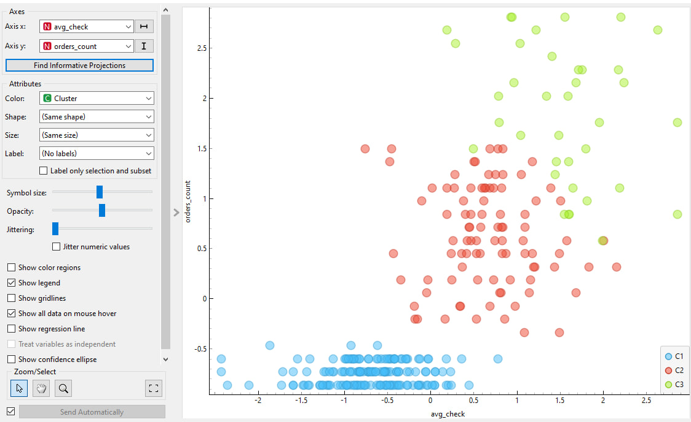
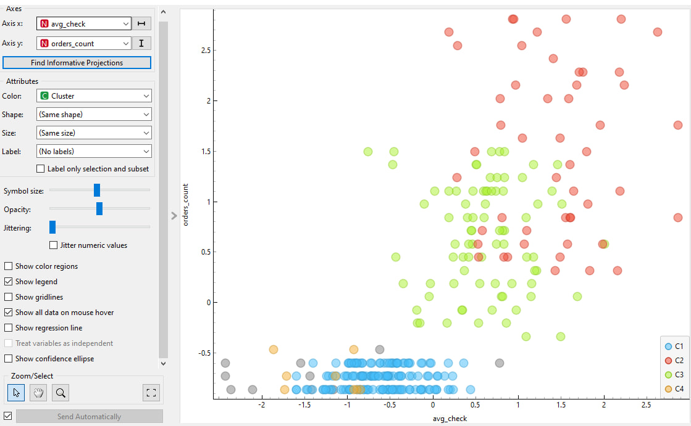
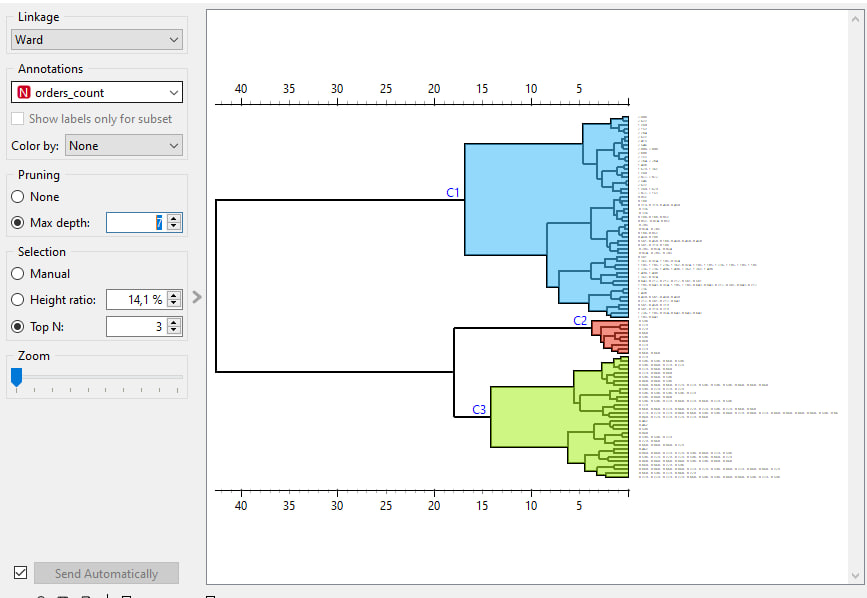
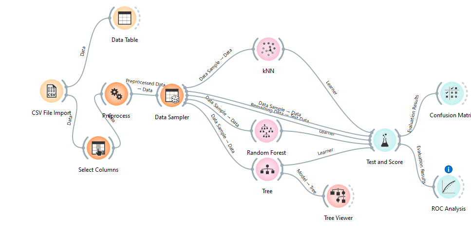
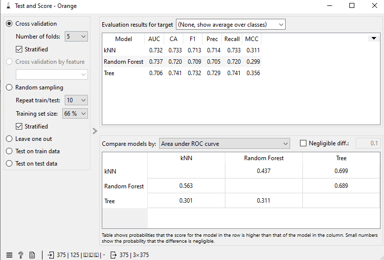
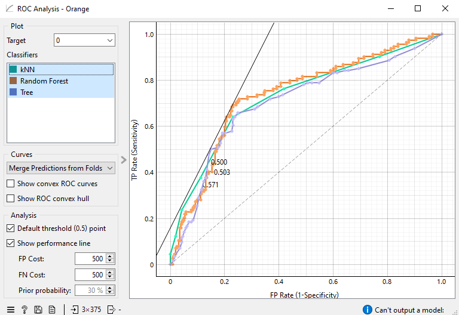
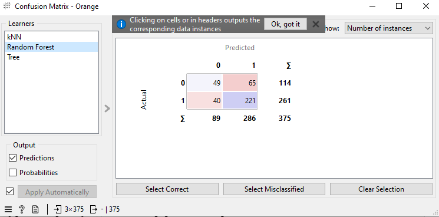

# Задания по дисциплине «Программирование и ИТ в научно-исследовательской работе»

**Тема ВКР:** Разработка модуля CRM-системы для автоматизации финансового и управленческого учёта предприятия сферы услуг  
**Направление:** 09.03.03 — Прикладная информатика

---

## Структура репозитория

```
├── README.md
├── data/
│   ├── clients_clustering.csv        ← датасет для кластеризации (300 клиентов)
│   └── orders_classification.csv    ← датасет для классификации (500 заказов)
├── notebooks/
│   ├── clustering_mafia_time.ipynb
│   └── classification_mafia_time.ipynb
└── screenshots/
    ├── orange_clustering_schema.png  ← добавить после сборки схемы
    ├── orange_clustering_kmeans.png
    ├── orange_clustering_dbscan.png
    ├── orange_clustering_hier.png
    ├── orange_classif_schema.png
    ├── orange_classif_scores.png
    ├── orange_classif_roc.png
    └── orange_classif_matrix.png
```

---

## Задание 1. Аннотированный список источников (5+)

### Источник 1

**Ledro, C., Nosella, A., Vinelli, A.** Artificial intelligence in customer relationship management: literature review and future research directions // *Journal of Business & Industrial Marketing*. — 2022. — Vol. 37, No. 13. — P. 48–63.  
DOI: [10.1108/JBIM-07-2021-0332](https://doi.org/10.1108/JBIM-07-2021-0332)

**Аннотация.** Библиометрическое исследование на базе 212 рецензируемых статей за 1989–2020 гг. Авторы систематизируют литературу о взаимосвязи ИИ и CRM, выделяя три направления: большие данные как база CRM, машинное обучение и предиктивная аналитика, автоматизация коммуникаций. Предложена трёхступенчатая концептуальная модель внедрения ИИ в CRM. Актуальна как теоретическая основа для обоснования автоматизации CRM-процессов применительно к малому бизнесу.

---

### Источник 2

**Ledro, C., Nosella, A., Vinelli, A., Dalla Pozza, I., Souverain, T.** Artificial intelligence in customer relationship management: a systematic framework for a successful integration // *Journal of Business Research*. — 2025. — Vol. 191. — Article 115202.  
DOI: [10.1016/j.jbusres.2025.115202](https://doi.org/10.1016/j.jbusres.2025.115202)

**Аннотация.** Качественное исследование на основе 25 интервью с AI-экспертами и компаниями, внедряющими ИИ в CRM. Авторы строят итеративную модель: от культурной готовности организации до масштабирования решений. Особый интерес представляет анализ ошибок при интеграции разнородных источников данных (соцсети, банки, маркетинговые платформы) — ситуация, характерная для кейса «Mafia Time».

---

### Источник 3

**Chatterjee, S., Ghosh, S. K., Chaudhuri, R., Nguyen, B.** Are CRM systems ready for AI integration? A conceptual framework of organizational readiness for effective AI-CRM integration // *The Bottom Line*. — 2019. — Vol. 32, No. 2. — P. 144–157.  
DOI: [10.1108/BL-02-2019-0069](https://doi.org/10.1108/BL-02-2019-0069)

**Аннотация.** Концептуальный фреймворк оценки готовности организации к AI-CRM интеграции по трём измерениям: технической, данных и организационной готовности. Используется при обосновании выбора собственной разработки вместо готовых виджетов amoCRM.

---

### Источник 4

**Das, S., Nayak, J.** Customer Segmentation via Data Mining Techniques: State-of-the-Art Review // *Computational Intelligence in Data Mining. Smart Innovation, Systems and Technologies*, vol. 281. — Singapore: Springer, 2022. — P. 489–507.  
DOI: [10.1007/978-981-16-9447-9_38](https://doi.org/10.1007/978-981-16-9447-9_38)

**Аннотация.** Систематический обзор 57 статей: K-Means, RFM и иерархическая кластеризация наиболее распространены для сегментации клиентов в CRM-системах. Служит теоретической основой для аналитической подсистемы и практических заданий по кластеризации клиентской базы «Mafia Time».

---

### Источник 5

**Mahadik, D., Shinde, A., Konale, A., Kadam, D., Auti, O.** To Study Webhooks for an Event-Driven Integration Mechanism // *ALOCHANA Journal*. — 2025. — Vol. 14, Issue 11.  
URL: [https://alochana.org/wp-content/uploads/6-AJ3851.pdf](https://alochana.org/wp-content/uploads/6-AJ3851.pdf)

**Аннотация.** Сравнение вебхуков с polling-подходами; анализ валидации payload и надёжности доставки событий. Непосредственно применимо к модулю обработки вебхуков amoCRM в дипломной работе.

---

### Источник 6

**WPI Team.** Webhooks-as-a-Service: A Custom API Design // *Worcester Polytechnic Institute Digital WPI*. — 2022.  
URL: [https://digital.wpi.edu/downloads/2n49t521z](https://digital.wpi.edu/downloads/2n49t521z)

**Аннотация.** Архитектура Webhook Dispatch System: Router Lambda (валидация payload) + Child Lambda (маршрутизация), хранилище на AWS DynamoDB. Решения учтены при проектировании backend-модуля обработки событий amoCRM.

---

### Источник 7

**Rahmatulloh, A., Nugraha, F., Gunawan, R., Darmawan, I.** Event-Driven Architecture to Improve Performance and Scalability in Microservices-Based Systems // *ICADEIS*. — IEEE, 2022. — P. 01–06.  
URL: [https://ieeexplore.ieee.org/document/9848872](https://ieeexplore.ieee.org/document/9848872)

**Аннотация.** Экспериментальное сравнение синхронных REST и асинхронной EDA при реальных нагрузках. Результаты подтверждают преимущество событийной модели по времени отклика — обосновывает выбор вебхуков для архитектуры модуля «Mafia Time».

---

## Задание 2. Кластеризация в Orange Data Mining

### Установка Orange

1. Перейти на **[https://orangedatamining.com/download/](https://orangedatamining.com/download/)**
2. Скачать установщик под свою ОС (Windows / macOS / Linux)
3. Запустить установщик, все настройки оставить по умолчанию
4. После запуска Orange откроется пустой **Canvas** (рабочая область со стрелкой слева)

> Никаких дополнительных модулей устанавливать не нужно — виджеты k-Means, DBSCAN и Hierarchical входят в базовую поставку.

---

### Данные

Файл: **`data/clients_clustering.csv`** (300 строк)

| Столбец | Описание |
|---|---|
| `orders_count` | Количество заказов клиента |
| `avg_check` | Средний чек (руб.) |
| `days_since_last_order` | Дней с последнего заказа |
| `response_time_hours` | Среднее время ответа менеджера (ч.) |
| `total_revenue` | Суммарная выручка по клиенту (руб.) |
| `segment` | Истинный сегмент — **не используется** в кластеризации, пометить как meta |

---

### Пошаговая сборка схемы

#### Шаг 1. Загрузить данные

- Левая панель → раздел **Data** → перетащить **`CSV File Import`** на холст
- Двойной клик → выбрать `clients_clustering.csv`
- Столбец `segment`: нажать на его тип → выбрать **meta** (не признак)
- Добавить **`Data Table`**, соединить стрелкой: `CSV File Import → Data Table`
- Открыть `Data Table` — убедиться в 300 строках

#### Шаг 2. Нормализация

- Добавить **`Preprocess`** (раздел Data)
- Соединить: `CSV File Import → Preprocess`
- Двойной клик → нажать **Add preprocessor** → выбрать **Normalize features** → метод **Standardize (Z-score)**

#### Шаг 3. K-Means

- Добавить **`k-Means`** (раздел Unsupervised)
- Соединить: `Preprocess → k-Means`
- Настройки: Number of clusters = **3**, Initialization = **k-Means++**, n_init = **10**
- Добавить **`Silhouette Plot`** → соединить с `k-Means`
- Добавить **`Scatter Plot`** → соединить с `k-Means`; выбрать: X = `avg_check`, Y = `orders_count`, Color = `Cluster`

#### Шаг 4. DBSCAN

- Добавить **`DBSCAN`** (раздел Unsupervised)
- Соединить: `Preprocess → DBSCAN`
- Настройки: **Epsilon = 1.5**, **Min. samples = 8**
- Добавить **`Scatter Plot`** → соединить с `DBSCAN`; Color = `Cluster` (серые точки — шум)

#### Шаг 5. Hierarchical Clustering

- Добавить **`Hierarchical Clustering`** (раздел Unsupervised)
- Соединить: `Preprocess → Hierarchical Clustering`
- Настройки: **Linkage = Ward**
- Внутри виджета видна дендрограмма — нажать и потянуть горизонтальный ползунок до разреза на **3 кластера**
- Добавить **`Scatter Plot`** → соединить с `Hierarchical Clustering`

---

### Схема на холсте (итог)

```
CSV File Import ──► Preprocess ──► k-Means          ──► Silhouette Plot
                                   k-Means          ──► Scatter Plot
                                   DBSCAN           ──► Scatter Plot
                                   Hierarchical     ──► Scatter Plot
CSV File Import ──► Data Table
```

---

### Скриншоты

> **Как сохранить:** в Orange нажать правой кнопкой на окно виджета → **Save Image**, либо стандартный скриншот (`Win+Shift+S` / `Cmd+Shift+4`). Сохранить в папку `screenshots/`.

**Скрин 1 — Общая схема на холсте**



*Рисунок 1 — Схема потока данных для кластеризации в Orange Data Mining*

---

**Скрин 2 — Scatter Plot: K-Means**



*Рисунок 2 — Визуализация кластеров K-Means (k=3)*

---

**Скрин 3 — Scatter Plot: DBSCAN**



*Рисунок 3 — Кластеры DBSCAN (eps=1.5, min\_samples=8), серые точки — шум*

---

**Скрин 4 — Дендрограмма Hierarchical Clustering**



*Рисунок 4 — Дендрограмма (Ward, 3 кластера)*

---

### Ожидаемые результаты

| Метод | Кластеров | Силуэт | Особенность |
|---|---|---|---|
| K-Means | 3 | ~0.45–0.55 | VIP / корпоративные / частные клиенты |
| DBSCAN | 2–3 + шум | ~0.40–0.50 | ~7% аномальных клиентов помечаются как шум |
| Hierarchical | 3 | ~0.43–0.53 | Иерархия сегментов видна на дендрограмме |

---

## Задание 3. Классификация в Orange Data Mining

### Данные

Файл: **`data/orders_classification.csv`** (500 строк)

| Столбец | Описание |
|---|---|
| `order_amount` | Сумма заказа (руб.) |
| `days_to_event` | Дней до мероприятия на момент выставления счёта |
| `client_orders_history` | Количество предыдущих заказов клиента |
| `response_time_hours` | Время ответа клиента на счёт (часов) |
| `is_corporate` | Корпоративный клиент (0/1) |
| `has_contract` | Подписан договор (0/1) |
| `paid` | **Целевая переменная**: оплачен заказ (1=да, 0=нет) |

---

### Пошаговая сборка схемы

#### Шаг 1. Загрузить данные

- `CSV File Import` → выбрать `orders_classification.csv`
- Столбец **`paid`**: тип → **Categorical**, роль → **Target**
- Соединить с `Data Table` для проверки

#### Шаг 2. Нормализация и разбивка

- Добавить **`Preprocess`** → Normalize features → Z-score
- Добавить **`Data Sampler`** (раздел Data)
  - Proportion of data = **75%**, включить **Stratify**, Random seed = **42**
  - Верхний выход = train, нижний выход = test (Remaining Data)

#### Шаг 3. Три классификатора

Все три подключить к выходу train (`Data Sample`):

| Виджет | Настройки |
|---|---|
| **`Tree`** | Max depth = 4, Min. samples in leaves = 10 |
| **`Random Forest`** | Number of trees = 100, Max depth = 6 |
| **`kNN`** | Number of neighbors = 7, Metric = Euclidean |

#### Шаг 4. Оценка

- Добавить **`Test and Score`** (раздел Evaluate)
- Подключить все три классификатора → `Test and Score`
- Подключить **Remaining Data** (test) → `Test and Score` (вход **Test Data**)
- Добавить **`ROC Analysis`** → соединить с `Test and Score`
- Добавить **`Confusion Matrix`** → соединить с `Test and Score`
- Добавить **`Tree Viewer`** → соединить с `Tree`

---

### Схема на холсте (итог)

```
CSV File Import ──► Data Sampler ──► Tree           ┐
                                     Random Forest  ├──► Test and Score ──► ROC Analysis
                                     kNN            ┘              └──► Confusion Matrix
                    Data Sampler (Remaining) ────────────► Test and Score
                    Tree ──► Tree Viewer
```

---

### Скриншоты

**Скрин 5 — Общая схема классификации на холсте**



*Рисунок 5 — Схема потока данных для классификации в Orange Data Mining*

---

**Скрин 6 — Test and Score (сводные метрики)**



*Рисунок 6 — Сравнение Accuracy, F1, AUC-ROC трёх классификаторов*

---

**Скрин 7 — ROC Analysis**



*Рисунок 7 — ROC-кривые Decision Tree, Random Forest, kNN*

---

**Скрин 8 — Confusion Matrix (Random Forest)**



*Рисунок 8 — Матрица ошибок Random Forest*

---

### Ожидаемые метрики

| Метод | Accuracy | F1 | AUC-ROC |
|---|---|---|---|
| Decision Tree | ~0.78 | ~0.80 | ~0.84 |
| Random Forest | ~0.83 | ~0.85 | ~0.90 |
| kNN | ~0.76 | ~0.78 | ~0.83 |

---

## Задания 4–5. JupyterLab — Python / scikit-learn

### Запуск

```bash
pip install scikit-learn pandas matplotlib seaborn scipy jupyter
jupyter lab
```

Открыть файлы из папки `notebooks/`.

### `clustering_mafia_time.ipynb`

K-Means · DBSCAN · Agglomerative Clustering на синтетическом датасете клиентов (300 записей).  
Включает: метод локтя, силуэт, k-distance graph, дендрограмму, сравнительный subplot.

### `classification_mafia_time.ipynb`

Decision Tree · Random Forest · KNN на датасете заказов (500 записей, целевая — `paid`).  
Включает: EDA, cross-val подбор k, важность признаков, ROC-кривые, матрицы ошибок.
